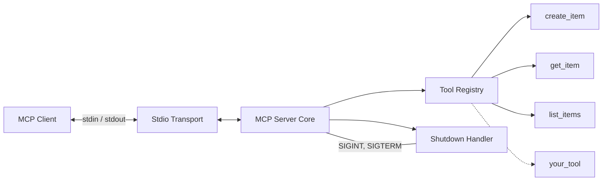

<p align="center">
  
</p>

<p align="center">
  <a href="https://github.com/protectyr-labs/mcp-starter/actions/workflows/ci.yml"></a>
  <a href="LICENSE"></a>
  <a href="https://www.typescriptlang.org/"></a>
  <a href="https://modelcontextprotocol.io"></a>
</p>

<p align="center">
  Production-grade MCP server template.<br>
  Stdio transport, modular tools, graceful shutdown, audit logging.
</p>

---

Clone it, add your tools, ship it. Handles stdio transport, graceful shutdown, and the gotchas that bite every first-time MCP developer.

## Quick Start

```bash
gh repo clone protectyr-labs/mcp-starter my-mcp-server
cd my-mcp-server
npm install && npm run build
```

Add to `claude_desktop_config.json`:

```json
{
  "mcpServers": {
    "my-server": {
      "command": "node",
      "args": ["/absolute/path/to/my-mcp-server/dist/index.js"]
    }
  }
}
```

## Architecture



## What You Get

- **Stdio transport** -- correct lifecycle, clean shutdown on SIGINT/SIGTERM
- **No `console.log`** -- the #1 mistake that corrupts MCP's stdio protocol
- **Modular tools** -- one file per tool group, register in `tools/index.ts`
- **3 example tools** -- `create_item`, `get_item`, `list_items` (replace with yours)
- **Graceful shutdown** -- handles SIGINT, SIGTERM, uncaughtException
- **CI pipeline** -- tests on Node 18, 20, and 22

## Use Cases

**I want to build an MCP server but don't know where to start.**
Clone this repo, replace the example tools with your own, and you have a working MCP server in 10 minutes. The hard parts (stdio transport, graceful shutdown, the console.log footgun) are handled.

**Internal tools for Claude.**
Give Claude access to your database, API, or file system via custom MCP tools. This template shows the pattern: define tools in `src/tools/`, register them, and Claude can call them.

**Prototyping agent capabilities.**
Before building a full agent system, prototype individual tools as MCP endpoints. Test them with Claude Desktop, iterate on the interface, then integrate into your agent framework.

**Teaching MCP development.**
Use this as a reference implementation when onboarding engineers to MCP. The code is minimal, commented, and demonstrates every production pattern (stdio, shutdown, no console.log, tool registration).

## Adding Your Own Tools

1. Create `src/tools/users.ts`:

```typescript
export function registerUserTools(server: Server) {
  // List your tools
  server.setRequestHandler(ListToolsRequestSchema, async () => ({
    tools: [{
      name: 'get_user',
      description: 'Look up a user by email',
      inputSchema: {
        type: 'object' as const,
        properties: { email: { type: 'string' } },
        required: ['email'],
      },
    }],
  }));

  // Handle calls
  server.setRequestHandler(CallToolRequestSchema, async (request) => {
    if (request.params.name === 'get_user') {
      return { content: [{ type: 'text', text: JSON.stringify(user) }] };
    }
    return { content: [{ type: 'text', text: `Unknown tool` }], isError: true };
  });
}
```

2. Register in `src/tools/index.ts`:

```typescript
import { registerUserTools } from './users.js';
registerUserTools(server);
```

3. `npm run build && npm test`

## Design Decisions

### ADR-001: Stdio over HTTP

The MCP spec defines stdio as the transport for local servers. When Claude Desktop launches your server, it communicates over stdin/stdout using JSON-RPC. No port conflicts, no firewall issues, no authentication layer needed. Process lifecycle is managed by the client. HTTP transport exists in the spec for remote servers, but most MCP servers are local tools. Start with stdio.

### ADR-002: Modular tool registration

Each tool group lives in its own file under `src/tools/`. Add a tool group: create a file, export a register function, add one line to `src/tools/index.ts`. Remove a tool group: delete the file and remove the import. Test a tool group: import its logic directly without starting the server. The alternative (all tools in one giant file) becomes unmanageable past 5-6 tools.

### ADR-003: No console.log, ever

The stdio transport uses stdout for JSON-RPC messages. A single `console.log("debugging...")` injects invalid data into the protocol stream, causing parse errors on the client side, dropped tool responses, and silent failures. All logging uses `console.error()`, which writes to stderr. This rule applies to every dependency you import.

### ADR-004: Graceful shutdown

MCP servers often hold resources: database connections, file handles, background pollers. The template handles SIGINT (Ctrl+C), SIGTERM (container stop), and uncaughtException. Add your cleanup logic inside the `shutdown()` function.

See [ARCHITECTURE.md](./ARCHITECTURE.md) for the full rationale.

## Production Checklist

| Check | Why |
|-------|-----|
| No `console.log()` anywhere | Corrupts the stdio protocol. Use `console.error()`. |
| SIGTERM handler present | Container orchestrators send SIGTERM before killing. |
| Input validation on all tools | MCP clients can send anything. Validate first. |
| Error responses use `isError: true` | Tells the client the call failed. |
| Tool descriptions are specific | Vague descriptions = wrong tool selection by the LLM. |
| `inputSchema.required` is set | Without it, LLMs may omit critical fields. |

## Built With This

- [mcp-exec-team](https://github.com/protectyr-labs/mcp-exec-team) -- multi-persona debate engine (5 tools)

## Limitations

- Example tools use in-memory store (replace with your database)
- No authentication (add your own middleware)
- Single-process only (no horizontal scaling)

> [!NOTE]
> This template targets local MCP servers using stdio transport. For remote/HTTP deployments, additional infrastructure (authentication, load balancing, health checks) is required.

## Origin

Built by [Protectyr Labs](https://github.com/protectyr-labs) while developing MCP tool servers for cybersecurity automation. After rebuilding the same stdio/shutdown/registration scaffolding across multiple projects, we extracted the pattern into this starter template. Every design choice comes from a production bug we hit first.

## License

MIT
